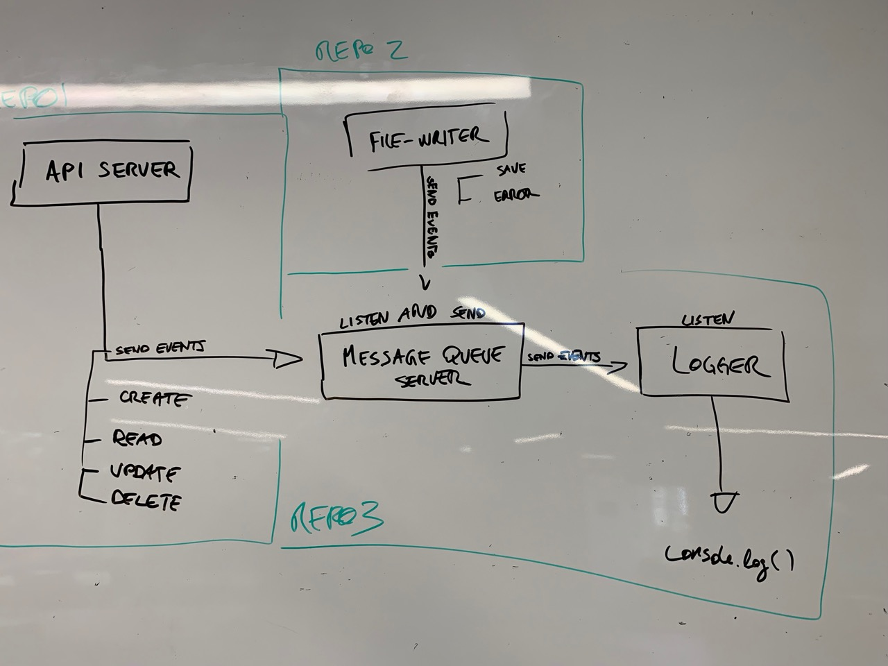

# LAB - 19

## Socket.io - Message Queue Server and Logger

### Author: Joé Jemmely

### Links and Resources

- [submission PR](https://github.com/401-advanced-javascript-joejemmely/lab-19-message-queue-server-and-logger/pull/1)
- [travis](https://github.com/401-advanced-javascript-joejemmely/lab-19-message-queue-server-and-logger)

#### Documentation

### Setup

#### Running the app

- `npm start`

#### Tests

- No test yet

#### UML

